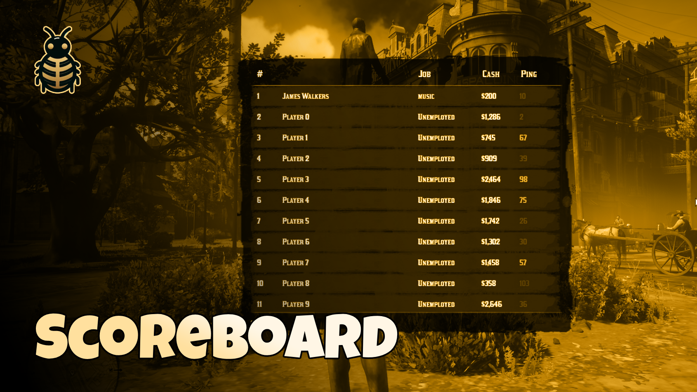

# RedM Scoreboard Script




A simple scoreboard system for RedM servers that displays list of players and their information including names, jobs, money, and ping. can be changed and modified to your needs.

[](https://youtu.be/M101-HDNKFw)
[](https://discord.bln-studio.com/)


## ✨ Features

- Display player list with key press or command
- Show player names, jobs, money, and ping
- Color-coded ping indicators
- Configurable settings
- Vue.js frontend for smooth rendering
- Framework integration support

## 🛠️ Configuration

```lua
Config = {
    key          = 0x26E9DC00,                -- Key to open the players (Z)
    command      = 'playerslist',             -- Command to open the players.
    title        = 'Players List',            -- Title on the board.
    showFakeData = true,                      -- Show fake data if there are no players (only for testing).
}
```

##  Works with
**✅ VORP ✅ REDEMRP(old/2023) ✅ RSG ✅QBR**

## 📋 Dependencies

- [bln_lib](https://bln.tebex.io/package/6520120)

## 💻 Usage
- `/playerslist` - Opens the scoreboard (Configurable)
- Press `Z` - Toggle scoreboard (Configurable)
- `ESC` - Close scoreboard

## ⚠️ Note

Set `showFakeData = false` in production to disable test data generation.

## Support 💬
Need help? Join our Discord server:
[Join Discord](https://discord.com/invite/MEZRYQVpnt)

## Credits 🙏
Created by [BLN Studio](https://bln.tebex.io)
Feel free to contribute to this project! 
